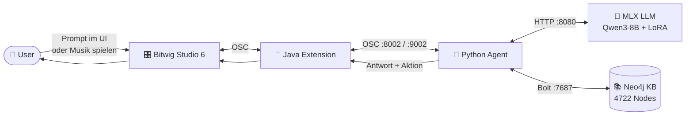
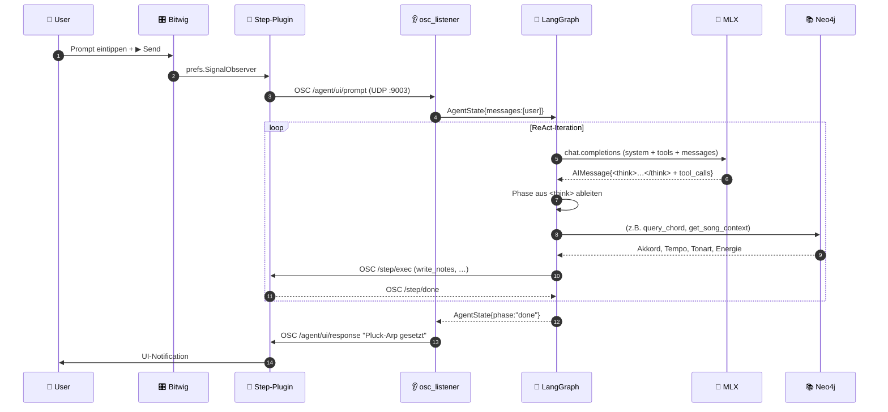
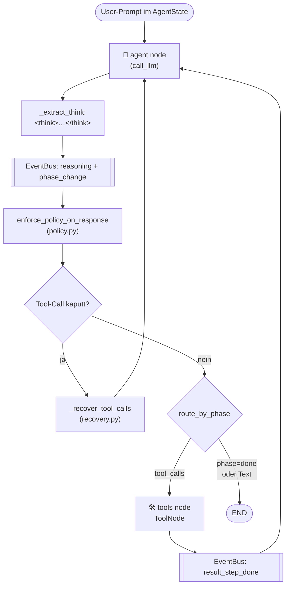
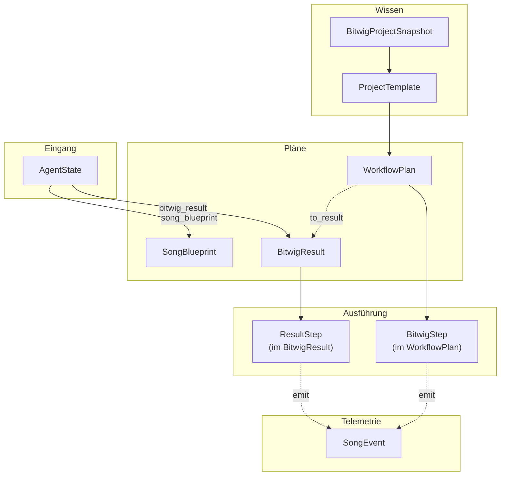
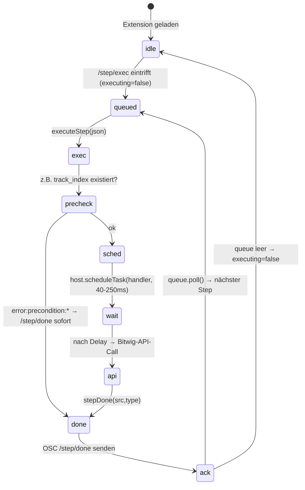
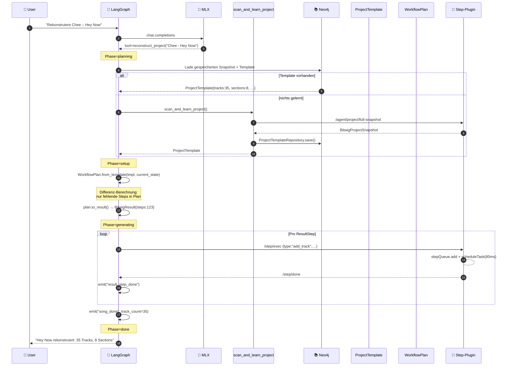

# Bitwig AI Agent — Dokumentation

> **Stand: Juni 2026** — Mac-Native, MLX-LLM, Step-Protocol, EventBus, Template-Pattern.
> Diese Datei ist der **Einstieg** und führt von außen (System) nach innen (Code).

---

## Navigation

| Tiefe | Datei | Inhalt |
|------|-------|--------|
| 🌍 Außen   | **dieses README**                                                           | System-Kontext, End-to-End-Pfad, Workflow-Objekte |
| 🏛 Übersicht | [`project_overview.md`](project_overview.md)                              | Stack, Tools, KB-Stats, Setup, Roadmap |
| 🔄 Agent   | [`agent_flow.md`](agent_flow.md)                                            | LangGraph-Topologie, EventBus, State-Machine |
| 🔌 Bitwig  | [`bitwig_llm_communication.md`](bitwig_llm_communication.md)                | OSC-Step-Protocol, Java-Queue, Ports |
| 🛠 Findings| [`architecture_improvements.md`](architecture_improvements.md)              | 12 Findings + Patterns + Ist-Stand |

---

## 1 · Was ist das System?  (Außenansicht)

Ein **lokaler, autonomer KI-Agent**, der **Bitwig Studio 6** über eine selbst entwickelte
Java-Extension steuert. Der Agent versteht Musik-Anfragen in natürlicher Sprache,
analysiert bestehende Projekte, rekonstruiert Songs und komponiert neue Pattern.
Er nutzt ein **lokal trainiertes LLM** (kein Cloud-Call) und eine **strukturierte
Musik-Wissensbasis** (Neo4j) als Reasoning-Grundlage.



**Charakteristika:**
- 🔒 **Vollständig lokal** — kein API-Schlüssel, keine Cloud-Latenz, keine Datenabflüsse.
- 🎯 **Domänen-spezifisch trainiert** — LoRA-Adapter `bitwig-adapter` auf 3019 musikalischen Trainingspaaren.
- 🧠 **Reasoning vor Handeln** — `<think>`-Block des LLM steuert die Pipeline-Phase.
- 🔁 **Bidirektional** — Agent liest Projektzustand, schreibt Veränderungen, hört auf User-Input live.

→ Detailliertere Übersicht inkl. Tools, KB-Stats, Setup: [`project_overview.md`](project_overview.md)

---

## 2 · End-to-End-Pfad einer Anfrage

Beispiel: User tippt im Bitwig-Preferences-Panel **"Pluck-Arp im Break, F# minor"**.



Drei Phasen, die wir nun einzeln aufschlüsseln:

| Phase | Wer | Was | Detail in |
|-------|-----|-----|-----------|
| **A** | Bitwig + Java | Prompt einsammeln & senden | [`bitwig_llm_communication.md`](bitwig_llm_communication.md) |
| **B** | Python Agent | Reasoning + Tool-Auswahl | [`agent_flow.md`](agent_flow.md) |
| **C** | Java + Bitwig | Steps ausführen (Schreiben) | [`bitwig_llm_communication.md`](bitwig_llm_communication.md) |

---

## 3 · Phase A — Eingang: User → Agent

In Bitwig läuft eine **selbst geschriebene Java-Controller-Extension**
(`BitwigStepPluginExtension`). Sie öffnet zwei OSC-Ports und ein Preferences-Panel
mit Freitext-Prompt + BPM-Slider.

```
[ Bitwig Preferences › Agent ]
    Prompt: [_____________________________]
    BPM:    [ 60 ──────●────── 200 ]
    [ ▶ Send ] [ Play ] [ Stop ] [ Status ]
```

Beim Klick auf **▶ Send** schickt die Extension `OSC /agent/ui/prompt` (UDP :9003)
mit JSON-Payload `{prompt, bpm}` an den Python-Agent.

`src/agent/osc_listener.py` empfängt das Paket, baut den initialen `AgentState`
(siehe [Abschnitt 5](#5--workflow-objekte)) und übergibt an `core.invoke()`.

---

## 4 · Phase B — Der Agent denkt

Der Agent ist ein **schlanker LangGraph mit nur 2 Nodes** (`agent` + `tools`),
gesteuert durch eine **conditional edge** `route_by_phase`. Drumherum sitzen:

- **`router.py`** — Vorab-Klassifikation: `song` / `control` / `knowledge`
- **`policy.py`** — Filtert tote Tool-Calls, extrahiert FX-Hints, Strict-Constraints
- **`recovery.py`** — Repariert kaputte LLM-Outputs (XML-Fragmente von Qwen)
- **`events.py`** — EventBus (Observer) für Pipeline-Feedback



→ **Vollständiges Flowchart + State Machine + Event-Pipeline:** [`agent_flow.md`](agent_flow.md)

### Was passiert in einer ReAct-Iteration?

```python
# vereinfacht aus core.call_llm
def call_llm(state: AgentState) -> dict:
    selected_tools = _select_tools_for_context(state["messages"])     # ① Tool-Filter
    response = llm.invoke([system] + state["messages"], tools=selected_tools)  # ② LLM
    reasoning, content = _extract_think(response.content)              # ③ Reasoning
    new_phase = _phase_from_reasoning(reasoning, state["generation_phase"])    # ④ Phase
    if new_phase != state["generation_phase"]:
        get_event_bus().emit("phase_change", {"from": state["generation_phase"], "to": new_phase})
    if _has_invalid_tool_output(response):                              # ⑤ Recovery
        response = _recover_tool_calls(response, state)
    response, policy = enforce_policy_on_response(state, response)      # ⑥ Policy
    return {"messages": [response], "generation_phase": new_phase}      # ⑦ State-Update
```

Die conditional edge **`route_by_phase`** entscheidet danach:
- `tool_calls vorhanden` → Node `tools` ausführen, Ergebnis zurück an `agent`
- `phase ∈ {done, error}` oder reine Text-Antwort → `END`
- Nudge nötig (Policy-Korrektur) → `agent` mit `HumanMessage` als Hinweis

---

## 5 · Workflow-Objekte

Der Agent operiert auf einem **kleinen Satz typisierter Datenobjekte**.
Sie definieren *Was* getan wird, der LangGraph definiert *Wann* und *Wie*.

### 5.1 · `AgentState` — der Pipeline-Kontext

```python
class AgentState(TypedDict):
    messages:           list                  # ChatHistory (Human/AI/Tool/System)
    track_count:        int                   # Snapshot vom letzten Status-Check
    tracks:             list[BitwigTrack]
    tempo:              float
    bridge_ok:          bool                  # Bitwig erreichbar?
    bitwig_result:      Optional[BitwigResult]    # aktuell laufender Plan
    generation_phase:   GenerationPhase           # idle/planning/setup/generating/verifying/done
    song_blueprint:     Optional[SongBlueprint]   # Komposi­tions­plan
    section_timeline:   list[SectionResult]       # bereits fertige Sections
    quality_report:     Optional[dict]
    pending_sections:   list[str]
    retry_count:        int
    ui_song_config:     Optional[dict]            # {prompt, bpm} aus Bitwig-UI
    # … plus Fan-Out-Felder (Legacy, derzeit ungenutzt)
```

`messages` ist der LangGraph-Standard, alle anderen Felder sind **agent-spezifisch**
und werden Schritt für Schritt befüllt. `generation_phase` ist die zentrale Steuergröße
der State-Machine (siehe [`agent_flow.md`](agent_flow.md#state-machine-generation_phase)).

### 5.2 · `BitwigResult` — der Ausführungsplan

Wenn das LLM erkennt, dass eine Anfrage **mehr als 2 deterministische Schritte**
braucht, erzeugt es ein `BitwigResult` statt vieler einzelner Tool-Calls.
Der `execute_result`-Executor läuft die Schritte einmal sequentiell ab — das
verhindert ad-hoc-Looping und macht den Verlauf reproduzierbar.

```python
class BitwigResult(TypedDict):
    context_type:   str             # "track" | "song" | "object"
    target:         dict            # {track_index} | {bpm, genre} | {type, ...}
    neo4j_context:  list            # Findings aus der KB
    steps:          list[ResultStep]
    summary:        Optional[str]

class ResultStep(TypedDict):
    type:   str                     # set_tempo | add_track | load_instrument | ...
    args:   dict                    # Step-spezifisch
    status: str                     # pending | done | error
    note:   Optional[str]           # LLM-Begründung
```

**Step-Typen** (analog zu den Java-Step-Handlern, [Tabelle hier](bitwig_llm_communication.md#step-typen-übersicht)):
`set_tempo`, `add_track`, `select_track`, `load_instrument`, `append_effect`,
`set_param`, `set_param_named`, `set_send`, `play`, `stop`.

### 5.3 · `BitwigProjectSnapshot` — der Zustand zum Lernen

Bei jedem `scan_and_learn_project`-Aufruf erstellt der Agent **einen einzigen
OSC-Roundtrip** (`/agent/project/full-snapshot`) und materialisiert den
kompletten Projektzustand als typisiertes Dataclass-Bündel.

```python
@dataclass
class BitwigProjectSnapshot:
    project_name:  str
    tempo:         float
    key:           Optional[str]
    tracks:        list[TrackSnapshot]    # name, type, devices, FX, params
    scenes:        list[SceneInfo]        # idx, name, clip_count
    timeline:      list[TimelineSection]  # CueMarker mit Position + Länge
    clips:         list[ClipInfo]         # scene_idx, has_content, length_beats
    samples:       list[AudioSample]      # erkannte Audio-Sample-Pfade
```

Aus einem Snapshot wird ein **Template** abgeleitet:

### 5.4 · `ProjectTemplate` — die deklarative Struktur

Template-Pattern: Beschreibt **was** ein Projekt enthalten soll, ohne wie/wann.
Aus einem `BitwigProjectSnapshot` baut `ProjectTemplate.from_snapshot()` eine
abstrakte Vorlage, die später auf einem leeren Projekt wieder angewendet
werden kann.

```python
@dataclass
class ProjectTemplate:
    name:         str
    bpm:          float
    key:          Optional[str]
    tracks:       list[TemplateTrack]   # role, instrument, fx_chain, params
    scenes:       list[TemplateScene]
    sections:     list[TemplateSection] # Cue-Marker mit Längen
```

### 5.5 · `WorkflowPlan` — das Ausführungs-Bindeglied

`WorkflowPlan` verbindet `ProjectTemplate` (das *Was*) mit dem `BitwigExecutor` (das *Wie*).

```python
@dataclass
class WorkflowPlan:
    steps:       list[BitwigStep]   # geordnete Step-Liste
    context:     str                # Beschreibung des Ziels
    template_name: str
    workflow_id: str

    @classmethod
    def from_template(cls, tmpl, current_snapshot) -> "WorkflowPlan":
        """Berechnet *Differenz* aktuell ↔ Template → nur fehlende Steps."""

    def to_result(self) -> BitwigResult:
        """Konvertiert in das BitwigResult-Format (für execute_result)."""

    def execute(self) -> dict:
        """Führt alle Steps aus und meldet Erfolg/Fehler an EventBus."""
```

In Neo4j wird der Plan als `Workflow`+`WorkflowStep`-Knoten persistiert
(`WorkflowRepository`), sodass dieselbe Sequenz später per Name wieder
ausgeführt werden kann.

### 5.6 · `SongBlueprint` — der Kompositionsplan

Vor dem ersten OSC-Step erstellt der Agent für *Song-Generierungs-Tasks* einen
`SongBlueprint`. Er beschreibt die Makro-Struktur, bevor Noten geschrieben werden.

```python
class SongBlueprint(TypedDict):
    genre:            str
    bpm:              float
    sections:         list[str]                  # ["intro","verse","chorus", …]
    section_bars:     dict[str, int]             # je Section
    chord_map:        dict[str, list[str]]       # Section → Akkordliste
    instrument_roles: list[str]                  # ["kick","bass","lead", …]
```

### 5.7 · `SongEvent` — die Pipeline-Telemetrie

Während der ganzen Ausführung emittieren `core.py`, `song_tools.py`,
`recovery.py` und `result-executor` strukturierte Events an den `EventBus`.

```python
class SongEvent(TypedDict):
    type:      str        # 14 vordefinierte Typen, siehe agent_flow.md
    payload:   dict       # event-spezifisch
    timestamp: float
```

→ **14 Event-Typen + Subscriber-Topologie:** [`agent_flow.md`](agent_flow.md#event-typen-übersicht)

### Beziehungs-Diagramm der Objekte



---

## 6 · Phase C — Der Agent handelt

Steht ein `BitwigResult` (oder direkter Tool-Call) fest, übersetzt der Agent
jeden `ResultStep` in eine OSC-Nachricht `/step/exec` an die Java-Extension.
Dort übernimmt eine **strenge sequenzielle Queue** mit dem Bitwig-Task-Scheduler:



**Warum so kompliziert?** Bitwig-API-Calls sind **asynchron**: ein
`addInstrument()` startet das Browser-Loading, antwortet aber nicht direkt.
Deswegen schichten wir Steps so:

1. **Queue (`stepQueue`)** garantiert: nur ein Step zur Zeit
2. **`host.scheduleTask(delay)`** gibt der DAW-Engine Zeit zwischen Aktion und Folge-Aktion
3. **`/step/done`-ACK** signalisiert dem Python-Agent „weiter machen"
4. **Circuit Breaker** (Python-Seite) verhindert Retry-Lawinen falls Bitwig nicht antwortet

→ **Sequenzdiagramm + Step-Typen-Tabelle + Port-Übersicht:** [`bitwig_llm_communication.md`](bitwig_llm_communication.md)

---

## 7 · Konkreter Workflow-Durchlauf am Beispiel

**Ziel:** „Rekonstruiere das Projekt 'Chee — Hey Now'"



**Phase-Übergänge im Beispiel:**
`idle` → `planning` → `setup` → `generating` → `done`

**Objekt-Fluss:**
`Snapshot` → `Template` → `WorkflowPlan` → `BitwigResult` → 123× `ResultStep` → 123× `/step/exec` → 123× `/step/done` → `SongEvent("song_done")`

---

## 8 · Zoom-In: Wo finde ich was?

| Frage | Datei |
|-------|-------|
| Welche Tools gibt es? | [`project_overview.md` Abschnitt Tools-Layer](project_overview.md#tools-layer-57-tools-gesamt) |
| Wie funktioniert das Phase-Routing? | [`agent_flow.md` State-Machine](agent_flow.md#state-machine-generation_phase) |
| Welche Events emittiert die Pipeline? | [`agent_flow.md` Event-Typen](agent_flow.md#event-typen-übersicht) |
| Welche OSC-Steps versteht die Java-Extension? | [`bitwig_llm_communication.md` Step-Typen](bitwig_llm_communication.md#step-typen-übersicht) |
| Welche Ports nutzt der Stack? | [`bitwig_llm_communication.md` OSC-Port-Übersicht](bitwig_llm_communication.md#osc-port-übersicht-mac-native) |
| Was ist im KB? | [`project_overview.md` Knowledge Base](project_overview.md#knowledge-base-neo4j) |
| Welche Architektur-Patterns sind umgesetzt? | [`architecture_improvements.md`](architecture_improvements.md) |
| Was ist noch offen? | [`project_overview.md` Roadmap](project_overview.md#nächste-roadmap-schritte) + [`architecture_improvements.md`](architecture_improvements.md) |

---

## 9 · Code-Verzeichnis (Wo lebt was?)

```
src/agent/
├── core.py              ← LangGraph (call_llm, route_by_phase, build_graph)
├── state.py             ← AgentState, BitwigResult, ResultStep, SongBlueprint
├── events.py            ← EventBus + SongEvent + 14 EventType-Literale
├── router.py            ← _route_request: song / control / knowledge
├── policy.py            ← enforce_policy_on_response (FX-Hints, dead-tool-filter)
├── recovery.py          ← _recover_tool_calls (XML-Fragment-Repair)
├── prompts.py           ← System-Prompt, Retrieve-Then-Reason-Anweisungen
├── llm_client.py        ← _get_llm: MLX-Server / MockLLM-Fallback
├── osc_listener.py      ← UDP :9003 (User-Prompts)
├── osc/
│   ├── client.py        ← OscClient (Socket, Reply-Parser, Timeout)
│   ├── circuit_breaker.py  ← CLOSED/OPEN/HALF_OPEN (Bitwig-Erreichbarkeit)
│   ├── saga.py          ← BitwigSaga (transaktionale Step-Sequenzen)
│   ├── track_state.py   ← Live-Polling von Track-Eigenschaften
│   ├── project_scan.py  ← Aggregiert /agent/project/full-snapshot
│   └── device_uuid.py   ← UUID-Lookup für Built-in-Devices
├── parsing/
│   └── tool_call_parsers.py  ← OpenAI / QwenXML / Truncated / Markdown
├── quality/
│   └── specs.py         ← TrackCount/Note/Scale/Velocity/Duration-Specs
├── models/
│   ├── project_snapshot.py  ← BitwigProjectSnapshot + Sub-Dataclasses
│   ├── project_template.py  ← ProjectTemplate (Template-Pattern)
│   ├── workflow_plan.py     ← WorkflowPlan (Bindeglied zu Executor)
│   ├── steps.py             ← Pydantic-Validierung pro Step-Typ
│   ├── track_plugins.py     ← Plugin-Pattern für Track-Generierung
│   └── result.py            ← BitwigResult-Konstruktor-Helfer
└── tools/
    ├── song_tools.py        ← build_song, write_pattern, verify_song
    ├── context_tool.py      ← get_song_context (Tempo, Key, Energie)
    ├── pattern_tools.py     ← compose_notes, suggest_notes
    ├── pattern_generators.py← Genre-spezifische Drum/Bass-Generatoren
    ├── recipe_tool.py       ← create_track_from_recipe
    ├── reconstruct_tool.py  ← reconstruct_project
    ├── project_learning_tool.py  ← scan_and_learn_project
    ├── audio_llm_tool.py    ← Music-Flamingo Audio-Verständnis
    ├── freesound_tool.py    ← Sample-Suche
    ├── web_search_tool.py   ← DuckDuckGo
    ├── mcp_bridge.py        ← Anbindung an 39 MCP-Tools
    └── knowledge/
        ├── rhythm_tool.py   ← get_rhythm_pattern (KB-gestützt)
        └── instrument_tool.py  ← get_instruments_for_song (KB-gestützt)

src/knowledge/
├── neo4j_graph.py       ← Connection + session()
├── repositories.py      ← DrumPattern/Instrument/ProjectSnapshot/Template/Workflow
├── store.py             ← Vektor-Search auf Document-Nodes
├── embedding_server.py  ← multilingual-e5-base auf :8082
├── ingest.py            ← KB-Ingest aus YAML/JSON
├── vst_scanner.py       ← VST3-Scan → InstrumentTemplate-Nodes
└── migrations/          ← Neo4j-Schema-Migrationen

bitwig-extension/src/main/java/.../
├── BitwigStepPluginExtension.java   ← :8002 / :9002 — Haupt-Endpoint
├── BitwigAgentBridgeExtension.java  ← :8001 / :9001 — Legacy/Snapshot
├── BitwigOscBridgeExtension.java    ← Container
└── LaunchpadControllerExtension.java← Hardware-Controller
```

---

## 10 · TL;DR — Der Agent in 5 Sätzen

1. **Der User tippt einen Prompt** in Bitwigs Preferences-Panel; eine Java-Extension schickt ihn als OSC `/agent/ui/prompt` an Python.
2. **Ein lokales LLM** (Qwen3-8B-4bit + LoRA via MLX :8080) plant in einem `<think>`-Block, welche Tools nötig sind, und ruft sie über LangGraph auf.
3. **Tools lesen Kontext** aus Bitwig (Snapshot) und Neo4j (Theorie/KB) und produzieren entweder direkten Text oder einen **`BitwigResult`-Plan** mit `ResultStep`-Liste.
4. **Jeder Step wird einzeln** als OSC `/step/exec` an die Java-Extension geschickt, dort streng sequenziell durch `stepQueue` + `host.scheduleTask` gegen die Bitwig-API ausgeführt und mit `/step/done` bestätigt.
5. **Der EventBus** sammelt 14 strukturierte Events während des ganzen Vorgangs (für JSONL-Audit-Log und Dashboard); am Ende geht eine Bestätigung über `/agent/ui/response` zurück ans Bitwig-UI.
