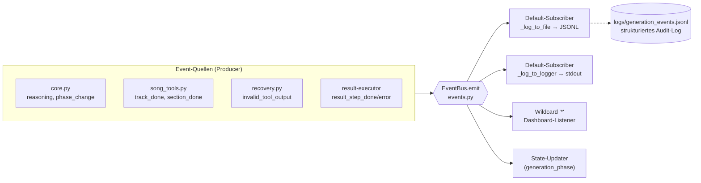
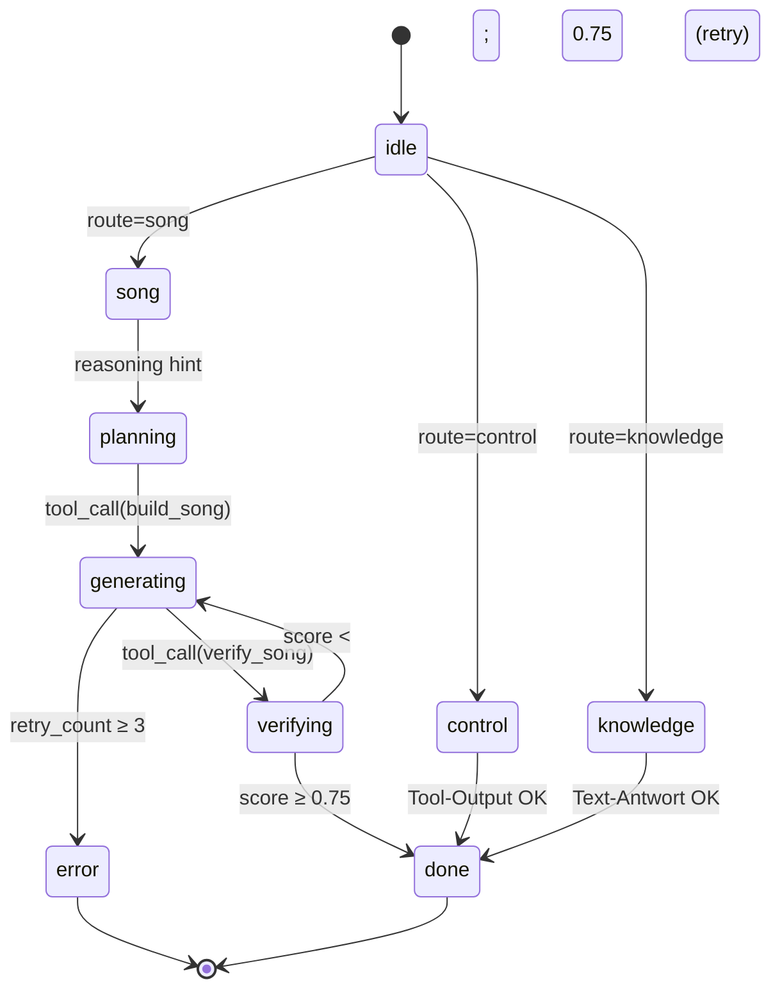

# Ablaufdiagramm — Bitwig AI Agent

> **Architektur-Update:** Der Agent verwendet jetzt eine **vereinfachte LangGraph
> ReAct-Schleife** (nur 2 Nodes: `agent` + `tools`) kombiniert mit einem
> **EventBus (Observer-Pattern)** für strukturiertes Pipeline-Feedback.
> Die Java-Extension nutzt einen **Step-Scheduler** mit `host.scheduleTask()`
> zur korrekten Staffelung der Bitwig-API-Aufrufe.

---

## LangGraph Execution Flow (ReAct-Loop + EventBus)

```mermaid
flowchart TD
    A([User Prompt<br/>/agent/ui/prompt]) --> OSC["osc_listener.py<br/>UDP :9003"]
    OSC --> ROUTE{_route_request<br/>song | control | knowledge}

    ROUTE -->|song / control / knowledge| GRAPH

    subgraph GRAPH ["LangGraph StateGraph  (core.py)"]
        direction TB
        ENTRY([entry_point]) --> AGENT["agent node<br/>call_llm"]

        AGENT --> EXTRACT["_extract_think<br/>&lt;think&gt;…&lt;/think&gt; herauslösen"]
        EXTRACT --> EMIT1[["EventBus.emit<br/>'reasoning' / 'phase_change'"]]
        EMIT1 --> POLICY["enforce_policy_on_response<br/>(policy.py)"]
        POLICY --> INVALID{_has_invalid<br/>_tool_output?}

        INVALID -->|ja| RECOVER["_recover_tool_calls<br/>XML-Fragment-Recovery"]
        RECOVER --> EMIT2[["EventBus.emit<br/>'invalid_tool_output'"]]
        EMIT2 --> AGENT

        INVALID -->|nein| ROUTER{route_by_phase}

        ROUTER -->|tool_calls vorhanden| TOOLS["tools node<br/>ToolNode  18 Agent + 39 MCP"]
        TOOLS -->|ToolMessage| EMIT3[["EventBus.emit<br/>'result_step_done'"]]
        EMIT3 --> AGENT

        ROUTER -->|nudge / HumanMessage| AGENT
        ROUTER -->|phase=done&#124;error<br/>oder Text-Antwort| ENDN([END])
    end

    ENDN --> REPLY["/agent/ui/response<br/>UDP zurück an Bitwig"]

    subgraph BUS ["EventBus Subscriber  (events.py)"]
        direction LR
        FILE[("logs/<br/>generation_events.jsonl")]
        LOGGER[["Python Logger<br/>(bitwig-agent.events)"]]
        DASH[("Dashboard /<br/>State-Updater")]
    end

    EMIT1 -.-> BUS
    EMIT2 -.-> BUS
    EMIT3 -.-> BUS
```

## Sequenzfluss — Beispiel: "Rock-Riff Em 140 BPM"

```mermaid
sequenceDiagram
    autonumber
    participant U   as User / Bitwig UI
    participant OSC as osc_listener<br/>UDP :9003
    participant CORE as core.call_llm
    participant LLM as MLX LLM Server :8080<br/>Qwen3-8B-4bit + Bitwig-LoRA
    participant POL as policy.py
    participant TN  as ToolNode<br/>(song_tools)
    participant BUS as EventBus
    participant EXT as BitwigStepPlugin<br/>UDP :8002

    U   ->> OSC: /agent/ui/prompt "Rock-Riff Em 140 BPM"
    OSC ->> CORE: invoke(AgentState{messages,…})

    Note over CORE: ── Iteration 1 ──
    CORE ->> LLM : chat.completions  (system + user + 57 tool schemas)
    LLM -->> CORE: AIMessage{<br/>&lt;think&gt;need build_song&lt;/think&gt;<br/>tool_calls=[build_song(…)]}

    CORE ->> CORE: _extract_think → reasoning
    CORE ->> BUS : emit("reasoning",{phase_hint:"song"})
    CORE ->> BUS : emit("phase_change",{from:"idle",to:"song"})
    CORE ->> POL : enforce_policy_on_response
    POL -->> CORE: ok

    CORE ->> TN  : ToolNode.invoke (build_song)

    Note over TN,EXT: build_song iteriert über Pattern-Sequenz
    loop Für jeden Step  (set_tempo, add_track, load_instrument,<br/>append_effect, write_notes, …)
        TN  ->> EXT: OSC /step/exec  {"type":"add_track","args":{…}}
        EXT ->> EXT: stepQueue.add() + scheduleTask(80ms)
        EXT -->> TN : OSC /step/done  "add_track"
        TN  ->> BUS: emit("result_step_done",{type:"add_track",index:3})
    end
    TN  ->> BUS : emit("track_done",{role:"guitar",notes:48})
    TN -->> CORE: ToolMessage(content="OK — Rock-Riff angelegt")

    Note over CORE: ── Iteration 2 ──
    CORE ->> LLM : chat.completions  (+ ToolMessage)
    LLM -->> CORE: AIMessage{content:"Rock-Riff angelegt:<br/>Phase-4 · 140 BPM · 48 Noten"}

    CORE ->> BUS : emit("song_done",{track_count:1})
    CORE -->> OSC: AgentState{phase:"done"}
    OSC ->> U   : /agent/ui/response "Rock-Riff angelegt: …"
```

## Event-Pipeline Detail



## State Machine (generation_phase)



## LangGraph Node-Übersicht

| Node / Komponente   | Datei                          | Funktion                                                  |
|---------------------|--------------------------------|-----------------------------------------------------------|
| `agent`             | `src/agent/core.py:call_llm`   | LLM-Aufruf, `<think>`-Extraktion, Phase-Inferenz          |
| `tools`             | `langgraph.prebuilt.ToolNode`  | Führt Tool-Calls aus, liefert `ToolMessage` zurück        |
| `route_by_phase`    | `src/agent/core.py`            | Routing: `tools` / `agent` (nudge) / `END`                |
| `_route_request`    | `src/agent/router.py`          | Vorab-Routing: song / control / knowledge                 |
| `_extract_think`    | `src/agent/core.py`            | `<think>…</think>` herauslösen → Phase-Inferenz           |
| `_recover_tool_calls`| `src/agent/recovery.py`       | Auto-Recovery für XML-Fragmente von Qwen3                 |
| `enforce_policy`    | `src/agent/policy.py`          | Genre-/Quality-Policies vor Tool-Ausführung               |
| `osc_listener`      | `src/agent/osc_listener.py`    | Empfängt `/agent/ui/prompt` auf UDP :9003                 |
| **EventBus**        | `src/agent/events.py`          | Observer-Pattern für Pipeline-Events (Singleton)          |

## Event-Typen Übersicht

| Event                   | Trigger                                          | Payload                                    |
|-------------------------|--------------------------------------------------|--------------------------------------------|
| `reasoning`             | LLM-Antwort enthält `<think>`-Block              | text, current_phase, detected_phase        |
| `phase_change`          | `generation_phase` ändert sich                   | from, to                                   |
| `invalid_tool_output`   | Kaputter Tool-Call vom LLM                       | diagnostic, retry, outcome                 |
| `track_done`            | Track-Pattern erfolgreich geschrieben            | role, notes                                |
| `section_start`/`_done` | Song-Section beginnt/endet                       | section                                    |
| `result_step_done`      | Einzelner Step (load_instrument etc.) erfolgreich| type, args, index                          |
| `result_step_error`     | Step fehlgeschlagen                              | type, args, index, error                   |
| `quality_check`/`_result`| `verify_song` läuft / Ergebnis                  | ok, score, details                         |
| `song_done`             | Gesamter Song fertig                             | track_count                                |
| `error`                 | Pipeline-Fehler                                  | message                                    |
