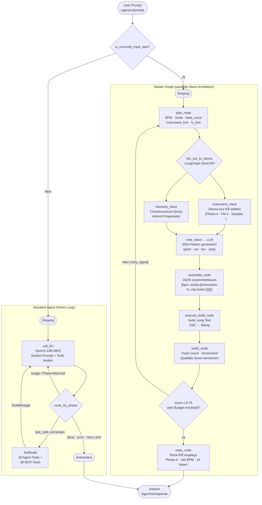
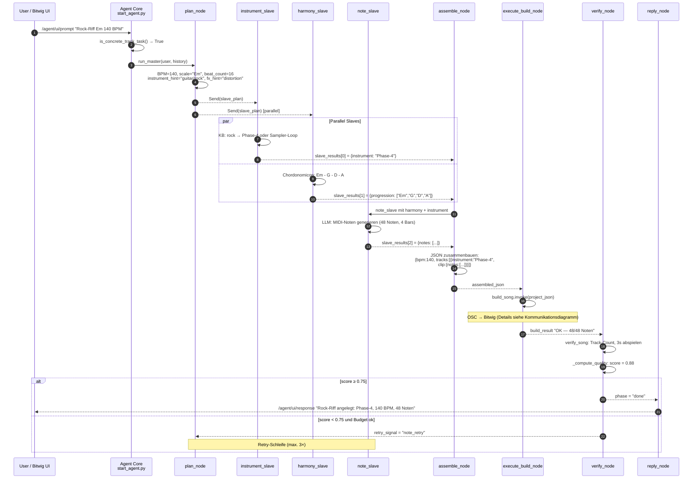

# Ablaufdiagramm — Bitwig AI Agent

## LangGraph Execution Flow

## Detaillierter Sequenzfluss (Master Graph — Beispiel: "Rock-Riff Em 140 BPM")

## LangGraph Node-Übersicht

| Node | Datei | Funktion |
|------|-------|----------|
| `call_llm` | `src/agent/core.py` | LLM aufrufen, Tool-Calls extrahieren, Phase verwalten |
| `route_by_phase` | `src/agent/core.py` | Routing: tools / nudge / END |
| `plan_node` | `src/agent/master_graph.py` | Prompt parsen → slave_plan |
| `fan_out_to_slaves` | `src/agent/master_graph.py` | Parallele Send-API |
| `instrument_slave` | `src/agent/slaves/` | KB-gestützte Instrument-Auswahl |
| `harmony_slave` | `src/agent/slaves/` | Chordonomicon-Akkordfolgen |
| `note_slave` | `src/agent/slaves/` | MIDI-Pattern via LLM |
| `assemble_node` | `src/agent/slaves/assemble.py` | Slave-Ergebnisse zusammenführen |
| `execute_build_node` | `src/agent/master_graph.py` | `build_song` Tool ausführen |
| `verify_node` | `src/agent/master_graph.py` | Qualitätsprüfung + Retry-Entscheidung |
| `reply_node` | `src/agent/master_graph.py` | Antworttext formatieren |
