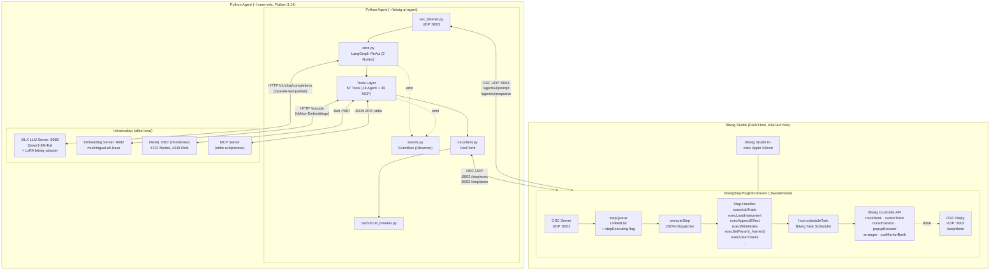
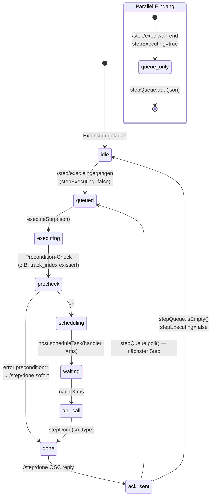

# Kommunikationsdiagramm — Bitwig ↔ LLM

> **Architektur-Update (Juni 2026):**
> - **Mac-Native Setup** — alle Komponenten laufen lokal auf dem Mac (kein Linux/WSL2/SSH).
> - **LLM** ist jetzt **Qwen3-8B-4bit (MLX)** mit eigenem LoRA-Adapter `bitwig-adapter`,
>   served via **MLX LLM Server** auf Port `:8080` (OpenAI-kompatible API).
>   Das alte Qwen3-14B-AWQ + vLLM ist abgelöst.
> - **Step-Protocol** — Python sendet `/step/exec` (JSON) an die Java-Extension,
>   die mit `stepQueue` + `host.scheduleTask()` Befehle gestaffelt ausführt und
>   `/step/done` als ACK zurückschickt.
> - **EventBus (Observer)** auf Python-Seite für Pipeline-Feedback.

---

## Systemübersicht (Komponentendiagramm — Mac-Native)



## Step-Protocol Sequenzdiagramm

```mermaid
sequenceDiagram
    autonumber
    participant U   as User / Bitwig UI
    participant LIS as osc_listener<br/>UDP :9003
    participant CORE as core.py<br/>(LangGraph)
    participant LLM as MLX :8080<br/>Qwen3-8B-4bit+LoRA
    participant KB  as Neo4j :7687
    participant CTX as get_song_context<br/>(context_tool.py)
    participant TOOL as song_tools.py
    participant BUS as EventBus
    participant EXT as BitwigStepPlugin<br/>UDP :8002 / :9002
    participant SCH as host.scheduleTask
    participant BW  as Bitwig API

    %% ── 1. Prompt-Eingang ─────────────────────────────────────────────────────
    U   ->> LIS : OSC /agent/ui/prompt "schreibe Pluck-Arp im Break"
    LIS ->> CORE: AgentState{messages:[user]}

    %% ── 2. LLM Iteration 1: Kontext holen ────────────────────────────────────
    CORE ->> LLM: POST /v1/chat/completions  (system + tools[57])
    LLM -->> CORE: tool_calls=[get_song_context()]

    CORE ->> CTX: get_song_context()
    CTX  ->> EXT: OSC /agent/project/full-snapshot
    EXT -->> CTX: tracks + scenes + clips + timeline
    CTX  ->> KB : MATCH (p:BitwigProject)-[:HAS_TIMELINE]->(t)<br/>RETURN tempo, key, sections, energy
    KB  -->> CTX: {tempo:144, key:"F# minor", sections:[…],<br/>scene_energy:{Break:1.0, Peak:0.96}}
    CTX -->> CORE: ToolMessage(Kontext-JSON: 35 Tracks, 17 Clips,<br/>43 Samples, full_key, energy)

    %% ── 3. LLM Iteration 2: Theorie-Query ────────────────────────────────────
    CORE ->> LLM: POST /v1/chat/completions  (+ Kontext)
    Note over LLM: &lt;think&gt; Break=100% → V-Akkord für Spannung<br/>F# minor → V = C#m &lt;/think&gt;
    LLM -->> CORE: tool_calls=[query_chord("C#m in F# minor")]

    CORE ->> KB : MATCH (s:Scale {name:"F# minor"})<br/>-[:DIATONIC_CHORD {degree:"V"}]->(c)
    KB  -->> CORE: {chord:"C#m", notes:[C#4,E4,G#4], strength:0.9}

    %% ── 4. LLM Iteration 3: write_pattern via Step-Protocol ──────────────────
    CORE ->> LLM: POST /v1/chat/completions  (+ Akkord)
    LLM -->> CORE: tool_calls=[write_pattern(track="Sharp Arp",<br/>notes=[C#4(s0,d3),E4(s4,d3),G#4(s8,d3)…])]

    CORE ->> TOOL: write_pattern.invoke(…)

    rect rgb(240, 248, 255)
        Note over TOOL,EXT: Step-Protocol: JSON-Steps, sequenziell
        loop Pro Step (select_track, write_notes, …)
            TOOL ->> EXT: OSC /step/exec {"type":"write_notes","args":{…}}
            alt stepQueue leer
                EXT  ->> EXT : stepExecuting = true
            else stepQueue belegt
                EXT  ->> EXT : stepQueue.add(json) <br/>(serialisiert!)
            end
            EXT  ->> SCH : scheduleTask(execWriteNotes, 0ms)
            SCH  ->> BW  : cursorClip.setStep(channel, step, …)
            BW  -->> SCH : (async API)
            SCH  ->> SCH : scheduleTask(stepDone, 80–250ms)<br/>(DAW-Wartezeit)
            SCH  ->> EXT : stepDone(src,"write_notes")
            EXT -->> TOOL: OSC /step/done "write_notes" (UDP :9002)
            TOOL ->> BUS : emit("result_step_done",{type,index})
            EXT  ->> EXT : nächster Step aus stepQueue.poll()
        end
    end

    TOOL ->> BUS : emit("track_done",{role:"arp",notes:16})
    TOOL -->> CORE: ToolMessage("OK — Sharp Arp, 16 Noten")

    %% ── 5. Antwort ────────────────────────────────────────────────────────────
    CORE ->> LLM: POST /v1/chat/completions  (+ ToolMessage)
    LLM -->> CORE: AIMessage("Sharp Arp im Break: C#m-Arpeggio<br/>(V-Akkord in F# minor) gesetzt")
    CORE ->> BUS: emit("song_done",{track_count:1})
    CORE -->> LIS: AgentState{phase:"done"}
    LIS  ->> EXT: OSC /agent/ui/response "Sharp Arp im Break …"
    EXT  ->> U  : UI-Display
```

## Step-Queue State Machine (Java)



## Step-Typen Übersicht

| Step-Type           | OSC-Args (JSON)                                              | Handler                  | Typ. Delay |
|---------------------|--------------------------------------------------------------|--------------------------|------------|
| `set_tempo`         | `{bpm: 140.0}`                                               | `execSetTempo`           | 0 ms       |
| `add_track`         | `{kind: "instrument" \| "audio" \| "group"}`                 | `execAddTrack`           | 80 ms      |
| `select_track`      | `{track_index: 1}`                                           | `execSelectTrack`        | 40 ms      |
| `load_instrument`   | `{track_index: 1, device: "Phase-4"}`                        | `execLoadInstrument`     | 200 ms (Browser, VST 2s) |
| `append_effect`     | `{track_index: 1, device: "Distortion"}`                     | `execAppendEffect`       | 200 ms (Browser) |
| `set_param`         | `{track_index: 1, index: 0, value: 0.7}`                     | `execSetParam`           | 0 ms       |
| `set_param_named`   | `{track_index: 1, name: "Cutoff", value: 0.5}`               | `execSetParamNamed`      | 40 ms      |
| `write_notes`       | `{track_index: 1, slot: 0, beats: 4, notes: [{…}]}`          | `execWriteNotes`         | per Note   |
| `clear_tracks`      | `{}`                                                         | `execClearTracks`        | 250 ms / Track |
| `play`              | `{}`                                                         | `transport.play()`       | 0 ms       |
| `stop`              | `{}`                                                         | `transport.stop()`       | 0 ms       |

## OSC-Port-Übersicht (Mac-Native)

| Port      | Protokoll        | Richtung          | Zweck                                                  |
|-----------|------------------|-------------------|--------------------------------------------------------|
| **8002**  | OSC UDP          | Agent → Bitwig    | `/step/exec` — JSON-Step (BitwigStepPlugin)            |
| **9002**  | OSC UDP          | Bitwig → Agent    | `/step/done` — ACK mit Step-Type                       |
| **8001**  | OSC UDP          | Agent → Bitwig    | Legacy `BitwigAgentBridge` (Snapshot, Ping)            |
| **9001**  | OSC UDP          | Bitwig → Agent    | Legacy Antworten (Track-Count, full-snapshot)          |
| **9003**  | OSC UDP          | Bitwig ↔ Agent    | `/agent/ui/prompt`, `/agent/ui/config`, `/agent/ui/response` |
| **8080**  | HTTP (OpenAI)    | Agent → MLX       | `POST /v1/chat/completions` — Qwen3-8B-4bit + LoRA     |
| **8082**  | HTTP             | Agent → Embedding | Vektor-Embeddings (multilingual-e5-base)               |
| **7687**  | Bolt TCP         | Agent → Neo4j     | Cypher + Vector-Search (Homebrew Service)              |
| **7474**  | HTTP             | Browser → Neo4j   | Neo4j Browser UI                                       |
| **stdio** | JSON-RPC         | Agent ↔ MCP       | MCP Tool-Server (subprocess)                           |

## Wesentliche Architektur-Eigenschaften

### 1. Sequenzielle Step-Verarbeitung (Java)
Die `stepQueue` (synchronized `LinkedList<String[]>`) und das `stepExecuting`-Flag
garantieren, dass nur **ein Step zur Zeit** läuft. Eingehende Steps während laufender
Ausführung werden eingereiht und nach `/step/done` automatisch weiterverarbeitet.

### 2. Bitwig-konformes Scheduling
Statt blockierender Waits verwendet die Extension **`host.scheduleTask()`** mit
typischerweise 40–250 ms Verzögerung (VST-Loading bis 2 s), damit Bitwig genug Zeit
hat, asynchrone API-Updates (Browser-Population, Device-Load, Bank-Refresh)
abzuschließen.

### 3. Observer-Pattern auf Python-Seite
Der **EventBus** (`events.py`) entkoppelt Pipeline-Events von Subscriber-Logik:
- Default-Subscriber: JSONL-Logger (`logs/generation_events.jsonl`) + Python-Logger
- Wildcard `*`-Subscriber für Dashboard/Monitoring
- Synchron, aber Exception-isoliert pro Subscriber

### 4. MLX statt vLLM
Auf Apple Silicon liefert **MLX** schnellere Inferenz als vLLM. Das Modell ist
**Qwen3-8B-4bit** mit einem projekt-spezifischen LoRA-Adapter (`bitwig-adapter`),
der auf ~3019 Trainingspaaren (Theorie + Format + Kontext) trainiert wurde.

### 5. Reduzierte LangGraph-Topologie
Nur **2 Nodes** (`agent` + `tools`) mit conditional edge `route_by_phase`.
Die alte Master/Slave-Architektur wurde durch die EventBus-getriebene
ReAct-Schleife ersetzt.
