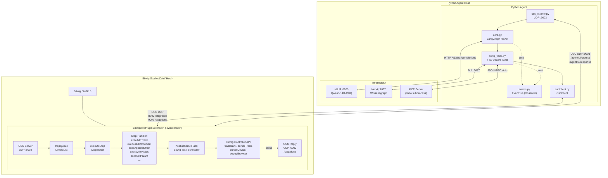
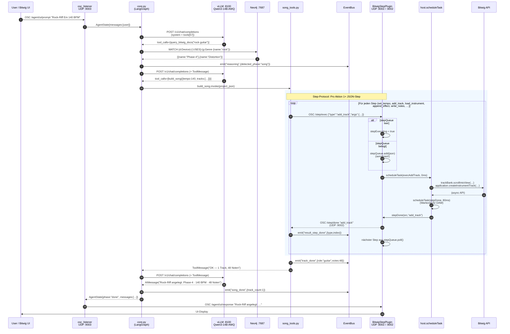
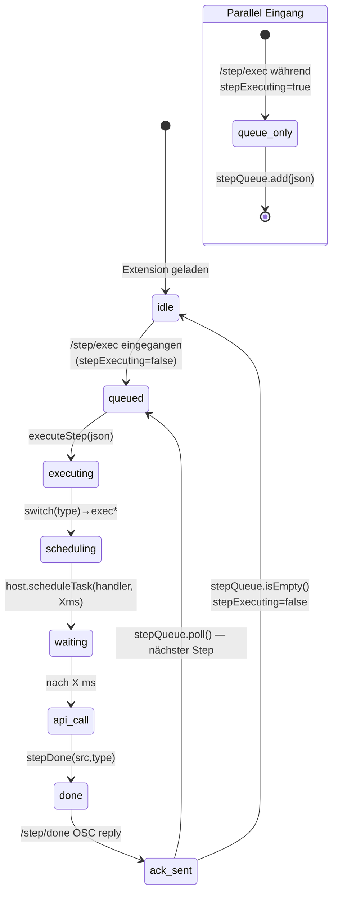

# Kommunikationsdiagramm — Bitwig ↔ LLM

> **Architektur-Update:** Die Kommunikation läuft jetzt über ein **JSON-Step-Protokoll**.
> Der Python-Agent sendet `/step/exec` mit einem JSON-Objekt (`type` + `args`) an die
> Java-Extension. Diese verwaltet eine **Step-Queue** und nutzt Bitwig's
> **`host.scheduleTask()`-Scheduler**, um API-Aufrufe korrekt gestaffelt auszuführen
> (z.B. 80ms nach Track-Add, 200ms nach Device-Load). Nach jedem Step kommt
> `/step/done` als ACK zurück.

---

## Systemübersicht (Komponentendiagramm)

## Step-Protocol Sequenzdiagramm

## Step-Queue State Machine (Java)

## Step-Typen Übersicht

| Step-Type           | OSC-Args (JSON)                                              | Handler                  | Delay |
|---------------------|--------------------------------------------------------------|--------------------------|-------|
| `set_tempo`         | `{bpm: 140.0}`                                               | `execSetTempo`           | 0 ms  |
| `add_track`         | `{kind: "instrument" \| "audio" \| "group"}`                 | `execAddTrack`           | 80 ms |
| `select_track`      | `{track_index: 1}`                                           | `execSelectTrack`        | 40 ms |
| `load_instrument`   | `{track_index: 1, device: "Phase-4"}`                        | `execLoadInstrument`     | 200 ms (Browser) |
| `append_effect`     | `{track_index: 1, device: "Distortion"}`                     | `execAppendEffect`       | 200 ms (Browser) |
| `set_param`         | `{track_index: 1, index: 0, value: 0.7}`                     | `execSetParam`           | 0 ms  |
| `set_param_named`   | `{track_index: 1, name: "Cutoff", value: 0.5}`               | `execSetParamNamed`      | 40 ms |
| `write_notes`       | `{track_index: 1, slot: 0, beats: 4, notes: [{…}]}`          | `execWriteNotes`         | varies|
| `clear_tracks`      | `{}`                                                         | `execClearTracks`        | 250 ms / track |
| `play`              | `{}`                                                         | `transport.play()`       | 0 ms  |
| `stop`              | `{}`                                                         | `transport.stop()`       | 0 ms  |

## OSC-Port-Übersicht

| Port      | Protokoll        | Richtung          | Zweck                                                  |
|-----------|------------------|-------------------|--------------------------------------------------------|
| **8002**  | OSC UDP          | Agent → Bitwig    | `/step/exec` — JSON-Step zur Ausführung                |
| **9002**  | OSC UDP          | Bitwig → Agent    | `/step/done` — ACK mit Step-Type                       |
| **8001**  | OSC UDP          | Agent → Bitwig    | Legacy `BitwigAgentBridge` (Track-Count, Ping)         |
| **9001**  | OSC UDP          | Bitwig → Agent    | Legacy Antworten (Track-Count int)                     |
| **9003**  | OSC UDP          | Bitwig → Agent    | `/agent/ui/prompt`, `/agent/ui/config`                 |
| **9003**  | OSC UDP          | Agent → Bitwig    | `/agent/ui/response` (Antworttext)                     |
| **8100**  | HTTP (OpenAI)    | Agent → vLLM      | `POST /v1/chat/completions` — Qwen3-14B-AWQ            |
| **7687**  | Bolt TCP         | Agent → Neo4j     | Cypher-Queries + Vector-Search                         |
| **stdio** | JSON-RPC         | Agent ↔ MCP       | MCP Tool-Server (39 Tools, subprocess)                 |

## Wesentliche Architektur-Eigenschaften

### 1. Sequenzielle Step-Verarbeitung
Die `stepQueue` (synchronized LinkedList) und das `stepExecuting`-Flag garantieren,
dass nur **ein Step zur Zeit** läuft. Eingehende Steps während einer laufenden
Ausführung werden eingereiht und nach `/step/done` automatisch weiterverarbeitet.

### 2. Bitwig-konformes Scheduling
Statt blockierender Waits verwendet die Extension **`host.scheduleTask()`** mit
typischerweise 40–250 ms Verzögerung, damit Bitwig genug Zeit hat, asynchrone
API-Updates (Browser-Population, Device-Load, Bank-Refresh) abzuschließen.

### 3. Observer-Pattern auf Python-Seite
Der **EventBus** (`events.py`) entkoppelt Pipeline-Events von Subscriber-Logik:
- Default-Subscriber: JSONL-Logger (`logs/generation_events.jsonl`) + Python-Logger
- Wildcard `*`-Subscriber für Dashboard/Monitoring
- Synchron, aber Exception-isoliert pro Subscriber

### 4. Reduzierte LangGraph-Topologie
Nur **2 Nodes** (`agent` + `tools`) mit conditional edge `route_by_phase`.
Die alte Master/Slave-Architektur wurde durch die EventBus-getriebene
ReAct-Schleife ersetzt.
