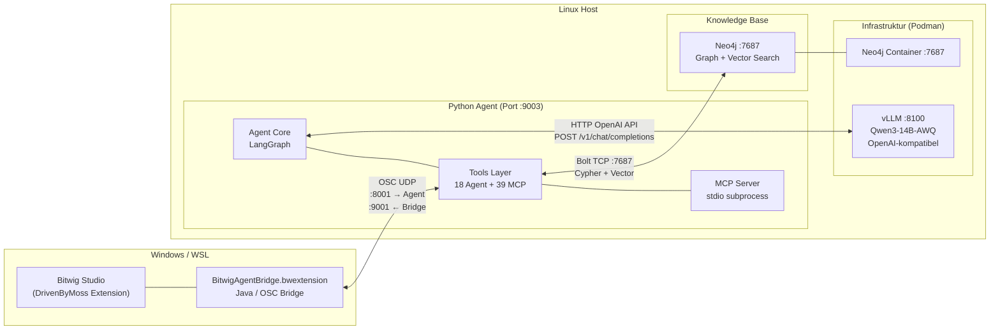
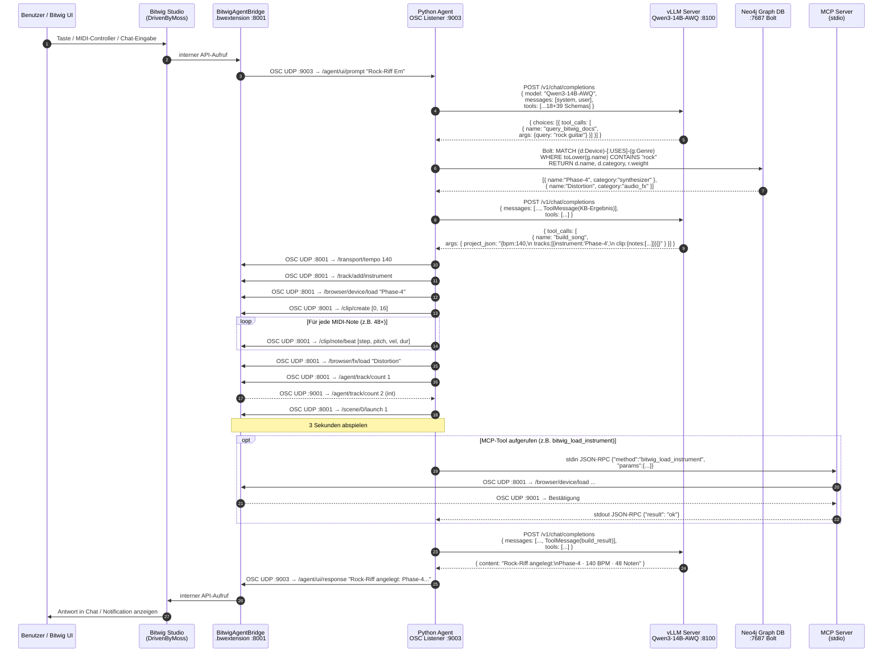

# Kommunikationsdiagramm — Bitwig ↔ LLM

## Systemübersicht (Komponentendiagramm)

## Vollständiger Kommunikationsfluss (Sequenzdiagramm)

## OSC-Nachrichtenprotokoll — Referenz

```mermaid
block-beta
    columns 3

    block:AGENT_TO_BW["Agent → Bitwig  (UDP :8001)"]:3
        T1["/transport/tempo  &lt;float&gt;"]
        T2["/transport/play  0|1"]
        T3["/transport/stop  1"]

        R1["/track/add/instrument  1"]
        R2["/track/{i}/select  1"]
        R3["/track/{i}/remove  1"]
        R4["/track/{i}/volume  &lt;0-1&gt;"]
        R5["/track/{i}/mute  0|1"]
        R6["/track/{i}/solo  0|1"]

        B1["/browser/device/load  &lt;name&gt;"]
        B2["/browser/preset/load  &lt;name&gt;"]
        B3["/browser/fx/load  &lt;name&gt;"]

        C1["/clip/create  [slot, beats]"]
        C2["/clip/note/beat  [step,pitch,vel,dur]"]
        C3["/clip/clear  1"]
        C4["/clip/step_size  0.25"]

        S1["/scene/{i}/launch  1"]
        S2["/arrange/record/start  1"]
        S3["/arrange/record/stop  1"]

        P1["/ping  1"]
        P2["/agent/track/count  1"]
    end

    block:BW_TO_AGENT["Bitwig → Agent  (UDP :9001)"]:3
        R10["/pong  1"]
        R11["/agent/track/count  &lt;int&gt;"]
        R12["/agent/ui/response  &lt;string&gt;"]
    end
```

## Port-Übersicht

| Port | Protokoll | Richtung | Beschreibung |
|------|-----------|----------|--------------|
| **8001** | OSC UDP | Agent → Bitwig | Befehle an DrivenByMoss Extension |
| **9001** | OSC UDP | Bitwig → Agent | Antworten (track count, pong) |
| **9003** | OSC UDP | Bitwig → Agent | User-Prompts, UI-Config |
| **8100** | HTTP (OpenAI API) | Agent → vLLM | LLM-Inferenz (Qwen3-14B-AWQ) |
| **7687** | Bolt TCP | Agent → Neo4j | Wissensbasis-Queries + Vektor-Suche |
| **stdio** | JSON-RPC | Agent ↔ MCP | MCP Tool-Server (subprocess) |
