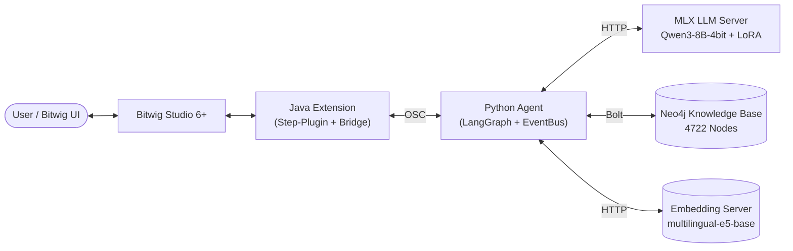

# Projektübersicht — Bitwig AI Agent

> **Stand: Juni 2026** — Mac-Native Setup, MLX-LLM, EventBus, Template-Pattern,
> 4722 Neo4j-Nodes, 3019 Trainingspaare.

---

## Was ist das?

Ein **autonomer KI-Agent für Bitwig Studio 6**, der mit musikalischem Reasoning
Songs versteht, analysiert, rekonstruiert und neue Pattern komponiert. Er nutzt
ein lokales, projekt-spezifisch trainiertes LLM, eine strukturierte
Musik-Wissensbasis und ein bidirektionales OSC-Protocol zu einer Java-Extension
in der DAW.

---

## High-Level Architektur



Detaillierte Diagramme:
- [`agent_flow.md`](agent_flow.md) — LangGraph Execution Flow + EventBus
- [`bitwig_llm_communication.md`](bitwig_llm_communication.md) — OSC Step-Protocol
- [`architecture_improvements.md`](architecture_improvements.md) — Verbesserungs-Findings

---

## Stack-Überblick

### LLM-Layer
| Komponente             | Wert                                                            |
|------------------------|-----------------------------------------------------------------|
| **Basis-Modell**       | **Qwen3-8B-4bit** (MLX-Format, Apple Silicon optimiert)         |
| **LoRA-Adapter**       | `bitwig-adapter` (~3019 Trainingspaare, 1000 Iters)             |
| **Server**             | **MLX LLM Server** auf `:8080` (OpenAI-kompatible API)          |
| **Trainingsdaten**     | Theorie (912) + Format (1416) + Kontext (6) + Genre (128) + KB-Export (557) |
| **Fallback**           | `MockLLM` für CI/Tests (`BITWIG_TEST_MODE=mock`)                |

> **Hinweis:** Das frühere `Qwen3-14B-AWQ` + `vLLM`-Setup ist abgelöst. `_get_llm()`
> in `src/agent/llm_client.py` zeigt noch den alten Default — Override via `.env`:
> `VLLM_BASE_URL=http://localhost:8080`, `VLLM_MODEL=default_model`.

### Agent-Layer (Python)
| Modul                          | Funktion                                                  |
|--------------------------------|-----------------------------------------------------------|
| `src/agent/core.py`            | LangGraph ReAct-Loop (2 Nodes), Phase-Inferenz aus `<think>` |
| `src/agent/events.py`          | EventBus (Observer-Pattern), 12 Event-Typen               |
| `src/agent/router.py`          | Vorab-Routing: song / control / knowledge                 |
| `src/agent/policy.py`          | Genre-/Quality-Policies vor Tool-Ausführung               |
| `src/agent/recovery.py`        | XML-Fragment-Auto-Recovery für Qwen3                      |
| `src/agent/osc_listener.py`    | UDP :9003 für UI-Prompts                                  |
| `src/agent/osc/client.py`      | `OscClient` (Socket-Binding, Reply-Parsing)               |
| `src/agent/osc/circuit_breaker.py` | Circuit Breaker für Bitwig-Erreichbarkeit             |
| `src/agent/models/`            | `BitwigProjectSnapshot`, `ProjectTemplate`, `WorkflowPlan`|

### Tools-Layer (57 Tools gesamt)
| Bereich                        | Beispiele                                                 |
|--------------------------------|-----------------------------------------------------------|
| **Bitwig-Steuerung** (`song_tools.py`) | `build_song`, `write_pattern`, `verify_song`      |
| **Kontext** (`context_tool.py`)| `get_song_context` (Tempo, Key, Szenen-Energie, Clips)    |
| **Knowledge-Base** (`knowledge_tool.py`) | `query_bitwig_docs`, `query_chord`, `query_genre`|
| **Project-Scan** (`project_learning_tool.py`) | `scan_and_learn_project`                   |
| **Rekonstruktion** (`reconstruct_tool.py`) | `reconstruct_project`, `create_track_from_recipe` |
| **Audio-Analyse** (`audio_llm_tool.py`) | via Music-Flamingo                               |
| **Web** (`web_search_tool.py`) | DuckDuckGo für Genre-/Künstler-Kontext                   |
| **MCP-Tools**                  | 39 weitere via `bitwig_mcp_server.py` (stdio)             |

### Java Extension (Bitwig-Seite)
| Extension                              | Port      | Zweck                                       |
|----------------------------------------|-----------|---------------------------------------------|
| **`BitwigStepPluginExtension`**        | 8002/9002 | Haupt-Endpoint: `/step/exec` Command-Queue + Scheduler |
| `BitwigAgentBridgeExtension`           | 8001/9001 | Legacy: Project-Snapshot, Cue-Markers, Save |
| `BitwigOscBridgeExtension`             | (Wrapper) | Container-Definition                        |
| `LaunchpadControllerExtension`         | —         | Novation Launchpad Mini Mk3 Mapping         |

### Knowledge Base (Neo4j)
| Daten                              | Anzahl     |
|------------------------------------|------------|
| Devices (mit UUIDs, UI-Pfaden)     | 389 / 568  |
| Parameter (Low/High-Beschreibung)  | 946        |
| Document-Nodes (Embeddings 768d)   | 826        |
| Genre-Nodes                        | 14 / 37    |
| Workflow → Device REQUIRES         | 953        |
| Genre → Device USES                | 120        |
| SIMILAR_TO Device-Paare            | 216        |
| ProductionPattern-Nodes            | 27         |
| Scale → Chord DIATONIC_CHORD       | 168 (24×7) |
| Chord → Chord RESOLVES_TO          | 288        |
| **Gesamt: Nodes / Relationships**  | **4722 / 4349** |

### Daten-Hierarchie (Zoom-Ebenen)
```
Note → Clip → Track → Song → Künstler → Genre │ Ökosystem → Hörer
   Neo4j strukturierte Daten                  │ LLM-Weltwissen
```

---

## Setup (Mac-Native, Stand Juni 2026)

| Komponente            | Pfad / Port                                                |
|-----------------------|------------------------------------------------------------|
| Repo                  | `~/bitwig-ai-agent/`                                       |
| Python venv           | `~/.venv-mlx/` (Python 3.14, mlx, mlx-lm, langchain, …)   |
| MLX Adapter           | `~/.ollama/models/mlx-models/bitwig-adapter/`              |
| Basis-Modell          | `~/.ollama/models/mlx-models/base/` (Qwen3-8B-4bit)        |
| Trainingsdaten        | `~/mlx-training/` (train.jsonl 2727, valid.jsonl 303)      |
| Embedding-Server      | `~/bitwig-agent/src/knowledge/embedding_server.py`         |
| Start-Skript          | `~/start_servers.sh`                                       |
| Neo4j                 | Homebrew 2026.05.0 als Service                             |

**`.env` Beispiel (Mac):**
```env
VLLM_BASE_URL=http://localhost:8080
VLLM_MODEL=default_model
NEO4J_URI=bolt://localhost:7687
NEO4J_USER=neo4j
NEO4J_PASSWORD=neo4jllm
BITWIG_HOST=127.0.0.1
BITWIG_OSC_PORT=8000
EMBEDDING_BASE_URL=http://localhost:8082
EMBEDDING_PORT=8082
KB_EMBED_MODEL=intfloat/multilingual-e5-base
```

**Start-Sequenz:**
```bash
# 1. Server-Stack hochfahren (MLX + Embedding + Neo4j)
~/start_servers.sh

# 2. Agent starten
cd ~/bitwig-ai-agent
source ~/.venv-mlx/bin/activate
python start_agent.py
```

---

## Was der Agent kann (Stand Juni 2026)

### ✅ Voll funktionsfähig
- **Projekt-Scan**: `scan_and_learn_project` → Tracks + Scenes + Groups + CueMarkers
  in einem OSC-Roundtrip (`/agent/project/full-snapshot`)
- **Kontext-Awareness**: `get_song_context` liefert Tempo, Tonart (aus Clips),
  Szenen-Energie (aus clip_count), polyphonie-bewusste MIDI-Noten, Audio-Samples
- **Projekt-Rekonstruktion**: `reconstruct_project("Chee - Hey Now")` →
  123 Steps (set_tempo + add_track + load + FX + params + notes) automatisch
- **Track-Recipes**: `create_track_from_recipe("Dissonant Pad")` einzeln einfügen
- **Built-in Devices**: Phase-4, Polysynth, Polymer, Sampler, Drum Machine, Poly Grid,
  E-Hat, Vocoder, EQ+, Compressor, Reverb, Delay+, Chorus+, Saturator …
- **MIDI-Schreiben**: polyphone Clips mit Tonart-validierten Pattern
- **Theorie-Queries**: diatonische Akkorde, Auflösungen, Stimmführung (DIATONIC_CHORD, RESOLVES_TO)
- **Web-Search** für Genre-/Künstler-/Stil-Wissen (DuckDuckGo, kein API-Key)
- **Live-Performance**: Launchpad Mini Mk3 als Pad-Controller

### ⚠️ Teilweise
- VST-Loading (2s Delay, normalisiertes Name-Matching, isSelected nötig)
- Custom-Preset-Loading (KickStartR, SUBMOTION etc.) via Browser unzuverlässig
- Jazz-Bewertung (Score 0.45 trotz korrektem Beat — mehr Training nötig)

### ❌ Fehlt noch
- **Send/Return-Routing** (Sidechain-Architektur) — höchste Prio aus Demo-Analyse
- **Track-Gruppen** (`/track/add/group`) — 1–2h Java-Arbeit
- **Drum Machine Multi-Slot Setup** — heute nur einzelne Drums
- **FX Grid Sidechain** via API — komplex, niedrige Prio
- **Parameter-Automation** (Bitwig 6 Project Remotes, Automation Spread)

---

## Architektur-Patterns (umgesetzt)

| Pattern               | Wo                                                                       |
|-----------------------|--------------------------------------------------------------------------|
| **Command Queue**     | Java `stepQueue` + `stepExecuting`-Flag (sequenzielle Ausführung)       |
| **Task Scheduler**    | Java `host.scheduleTask()` (40–250 ms gestaffelte DAW-Updates)          |
| **Observer**          | Python `EventBus` (`events.py`) mit 12 Event-Typen + Wildcard           |
| **Circuit Breaker**   | `src/agent/osc/circuit_breaker.py` (Bitwig-Erreichbarkeit)              |
| **Template + Plugin** | `BitwigProjectSnapshot` → `ProjectTemplate` → `WorkflowPlan`            |
| **ReAct Loop**        | LangGraph 2-Node (`agent` + `tools`) mit conditional `route_by_phase`   |
| **Repository**        | `ProjectSnapshotRepository`, `ProjectTemplateRepository`, `WorkflowRepository` |
| **Strategy / Router** | `_route_request` (song / control / knowledge) in `router.py`            |

---

## Codebase-Metriken

```
src/agent/         ~7.500 LOC Python (Agent-Core)
src/knowledge/     ~3.500 LOC Python (Neo4j-Layer)
bitwig-extension/  ~4.398 LOC Java (Bitwig Extensions)
agent-plugin/      ~1.200 LOC (Screenshot-Server)
scripts/           ~6.000 LOC (Ingest + Training)
tests/             205 Unit-Tests + Integration-Tests
```

---

## Wichtige Sessions / Memory-Files

(siehe `~/.claude/memory/` im Hauptrepo)

- `project_template_architecture.md` — Template + Plugin Pattern (Juni 2026)
- `project_mac_native_setup.md` — Mac-Native Setup
- `project_context_tool.md` — `get_song_context()` voll ausgebaut
- `project_zoom_levels.md` — Daten-Hierarchie Note → Genre
- `project_theory_bitwig_mapping.md` — Musiktheorie → Bitwig
- `project_musical_training_data.md` — 3019 Trainingspaare-Pipeline
- `project_chee_hey_now.md` + `project_ferrous_rhythm.md` — Demo-Analysen
- `project_knowledge_base.md` — Neo4j-Stand (4722 Nodes)
- `project_open_tasks.md` — 10 priorisierte Verbesserungen

---

## Nächste Roadmap-Schritte

**Höchste Priorität:**
1. Return-Track-Unterstützung in Java (`/track/add/return`, `/track/{n}/send_to`)
2. Track-Gruppen-Endpoint (`/track/add/group`)
3. Drum-Machine Multi-Pad-Setup
4. `call_llm()` (214 Zeilen) in `_invoke_with_retry()` + `_apply_nudge()` aufteilen
5. Jazz-Trainingsdaten erweitern (Ride statt HiHat, Offbeat-Snare, Walking Bass)
6. `_query_neo4j()` (300 Zeilen) in 6 separate Query-Funktionen splitten
7. **MidiClip → Scene** als echte Relation (statt String-Feld)
8. **AudioSample → SoundRecipe** verknüpfen
9. **Artist-Node** + `get_artist_context()` Tool
10. SIMILAR_TO-Kanten zwischen Projekt-Embeddings (Vektor-Ähnlichkeit)
